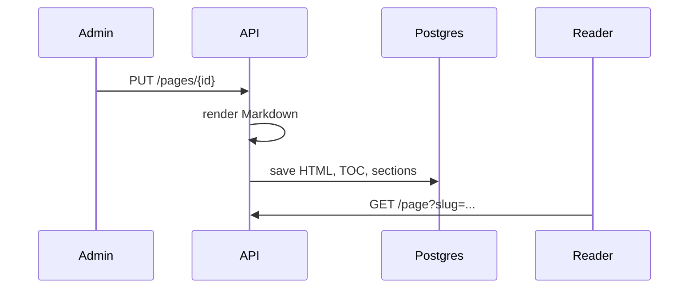

Fenced code blocks are highlighted on the server with
[Chroma](https://github.com/alecthomas/chroma), which knows hundreds of
languages. The reader adds a copy button to every block.

## Usage

~~~mdx
```go title="main.go"
package main

func main() {
	println("hello, jevidocs")
}
```
~~~

```go title="main.go"
package main

func main() {
	println("hello, jevidocs")
}
```

## Title

`title="..."` after the language adds a caption with the file name. Without a
title the block has no caption:

```ts
const res = await fetch('https://api.jevidocs.jevido.app/api/projects')
const projects = await res.json()
```

## Languages

Use the usual names: `go`, `ts`, `js`, `svelte`, `sh`, `json`, `yaml`, `sql`,
`md`, `html`, `css`, `dockerfile`, … Unknown or missing languages render as
plain text.

```sql title="search.sql"
SELECT slug, title
FROM pages
WHERE to_tsvector('english', title || ' ' || plain) @@ to_tsquery('english', 'deploy:*');
```

```json
{ "type": "page", "name": "Introduction", "slug": "" }
```

<Callout type="info">
Highlighting uses CSS classes (`.chroma .k`, `.chroma .s`, …), styled with
GitHub's light and dark palettes by the reader.
</Callout>

## Highlight lines

Put line numbers or ranges in braces after the language, as with shiki in
fumadocs:

~~~mdx
```ts {1,3-4}
const a = 1
const b = 2
const c = 3
const d = 4
```
~~~

```ts {1,3-4}
const a = 1
const b = 2
const c = 3
const d = 4
```

## Line numbers

Add `lineNumbers` (or `showLineNumbers`) to the fence:

~~~mdx
```go title="main.go" lineNumbers
package main

func main() {
	println("numbered")
}
```
~~~

```go title="main.go" lineNumbers
package main

func main() {
	println("numbered")
}
```

## Notations

Comments ending in `[!code ...]` mark a line and are removed from the
output. They work with `//`, `#`, `--`, `;`, `/* */` and `<!-- -->`
comments.

| Notation | Effect |
| -------- | ------ |
| `[!code highlight]` (or `hl`) | Highlight the line |
| `[!code ++]` | Mark as added |
| `[!code --]` | Mark as removed |
| `[!code focus]` | Focus the line; others are dimmed until hover |

~~~mdx
```ts
const config = {
  port: 4730, // [!code --]
  port: 8080, // [!code ++]
  host: '0.0.0.0', // [!code highlight]
}
```
~~~

```ts
const config = {
  port: 4730, // [!code --]
  port: 8080, // [!code ++]
  host: '0.0.0.0', // [!code highlight]
}
```

~~~mdx
```go
func main() {
	app := bootstrap.Boot()
	app.Start() // [!code focus]
}
```
~~~

```go
func main() {
	app := bootstrap.Boot()
	app.Start() // [!code focus]
}
```

<Callout type="info">
Notations are not applied inside `md`/`mdx` fences, so pages like this one
can show them as examples.
</Callout>

## Diagrams

A `mermaid` fence becomes a diagram. The reader loads
[Mermaid](https://mermaid.js.org) only on pages that have one and redraws it
when the theme changes. Each diagram sits on a pan/zoom canvas at its natural
size; `layout: elk` in the diagram's config gives overlap-free layouts (see
[Markdown](/docs/writing/markdown#diagrams)).

~~~mdx

~~~


