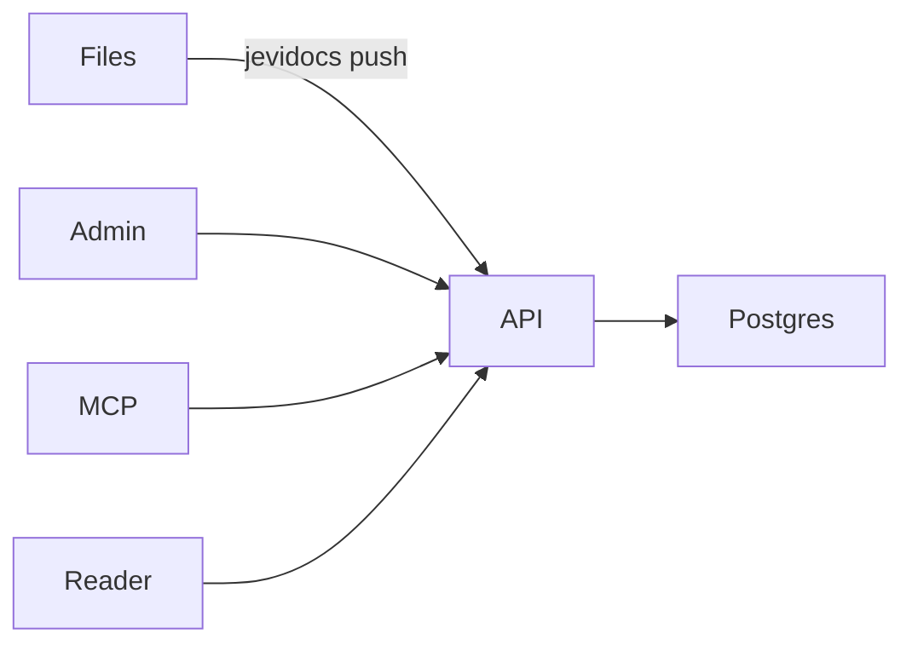

Pages are [CommonMark](https://commonmark.org) with the
[GitHub Flavored Markdown](https://github.github.com/gfm/) extensions and
footnotes, rendered by [goldmark](https://github.com/yuin/goldmark) on the
server.

## Supported syntax

| Feature | Example |
| ------- | ------- |
| Emphasis | `**bold**`, `_italic_`, `~~struck~~` |
| Links | `[text](/docs/quick-start)`, bare URLs are autolinked |
| Tables | pipe tables with alignment |
| Task lists | `- [x] done` |
| Footnotes | `text[^1]` and `[^1]: note` |
| Code | fenced blocks with a language and an optional `title="..."` |
| HTML | raw HTML is passed through |

- [x] Task lists render as checkboxes
- [ ] Like this one

Footnotes work too.[^note]

[^note]: Rendered at the bottom of the page.

## Headings

`##` to `####` headings get a GitHub-style `id`, an anchor link, and an entry
in the table of contents ("On this page"). Duplicate titles get `-1`, `-2`
suffixes. The page title comes from front matter, so start the body at `##`.

## Components

Components are written like MDX, but each opening and closing tag must be
**on its own line**, outside code blocks:

```mdx title="page.md"
<Callout type="warn" title="Heads up">
Body with **markdown**.
</Callout>
```

<Callout type="warn" title="Leave blank lines where Markdown needs them">
A component body is ordinary Markdown. Lists, code fences and headings inside
a component still need the blank lines Markdown requires around them.
</Callout>

A whole component on one line also works for short content:

```mdx
<Callout type="success">Saved!</Callout>
```

See [Components](/docs/components) for every component.

## GitHub alerts

GitHub's alert syntax renders as a [Callout](/docs/components/callout):

~~~mdx
> [!NOTE]
> Useful information.

> [!TIP]
> A helpful suggestion.

> [!WARNING]
> Something needs attention.

> [!CAUTION]
> Risky: think twice.
~~~

> [!NOTE]
> Useful information.

> [!TIP]
> A helpful suggestion.

> [!WARNING]
> Something needs attention.

> [!CAUTION]
> Risky: think twice.

`[!IMPORTANT]` works too. A blockquote without a marker stays a quote:

> Documentation is a love letter to your future self.

## Diagrams

Fence a [Mermaid](https://mermaid.js.org) diagram with `mermaid`:

~~~mdx

~~~


More code block options (line highlights, numbers, diffs, focus) are on
[Code blocks](/docs/components/code-blocks).

## Images

Images use normal Markdown, load lazily, and open full size when clicked:

~~~mdx

~~~


## Links

Link between pages with their reader URL: `/docs/<slug>` inside the jevidocs
project, `/p/<project>/<slug>` elsewhere. The reader turns these into
client-side navigations.
